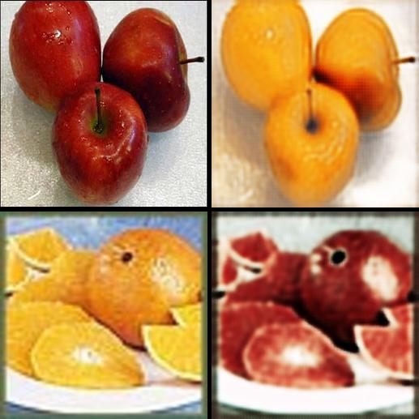
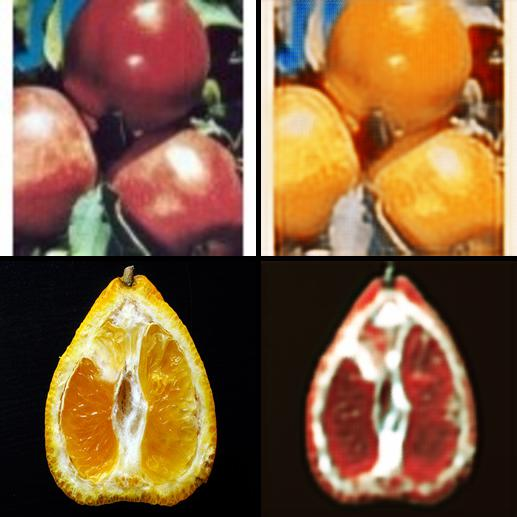

# cycleGAN
Coding and learning, an implementation of cycleGAN.

You can find the original paper on:
https://junyanz.github.io/CycleGAN/

## TensorFlow version
tensorflow 1.1.0

## Results
more results are coming soon.

|      input ->  output         |       input ->    output      |
|-------------------------------|-------------------------------|
  |  

## Files structure
* `main.py`   run this file to train model
* `ops.py`    contains functions which will be used to build model 
* `utils.py`  contains a class which will be used to prepare data

## Notes:
* Different size of input requires different structure of model. input[128x128]: 6 blocks; input[256x256]: 9 blocks.
* Residual block in this paper is a little different than the original one. The small difference is that in original paper the
author removes the last relu layer in residual block. 
* In original paper, the author uses regular batch normalization, however, it is recommended to use instance normalization.
* Least square loss was used, and then we need to remove the last sigmoid activation function in discriminator. It turns out 
to perform better and more stable. In Pix2Pix project, sigmoid layer is required for discriminator.
* Results is sensitive to initialization. Sometimes color of background and object are reversed. You can rerun code to avoid 
it.
